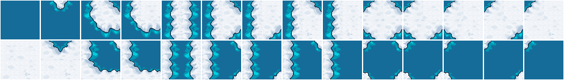
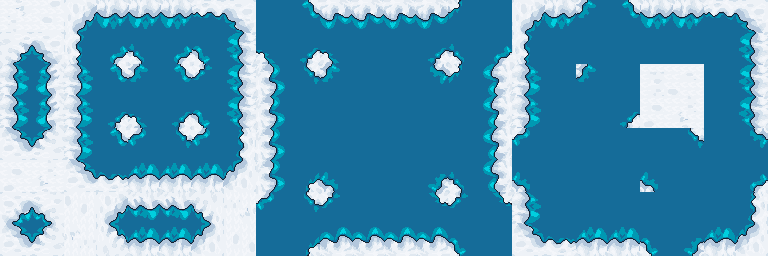

# Autotiler
Unpacks tilesets from a compressed one

Pure go. No external dependencies

## Disclaimer

Project is in alpha state. Was quickly developed to do stuff, so code is not pretty, but functional.

## Features

Autotiler unpacks tileset like this to formats more suitable for map generation (e.g. 16 and 47 wang tilesets):


## How to use
* [get yourself Go](https://go.dev/doc/install)
* clone this repository or download sources.
* put simple tileset image (for example 2x3_packed.png) to source folder
* run ```go run . -in <file_in> [-o <file_out>] [-p <padding>] [-e <export_type(16,28,48,all)>]```

  e.g. ```go run . -in ./examples/2x3_packed.png -o ./out/output.local.png -p 1 -e 16 -e 28 -e 48```
* you can optionally set padding for tiles in px. To do so you need to add desired padding as argument:

  e.g. ```go run . -in ./examples/2x3_packed.png -p 1``` - this will create tilesets with 1 px margin and 2px spacing.
* grab complete tilesets from directory specified in `-o`.
* don't worry about filenames, as program will automatically prefix output files with necessary information. E.g. for options `-o ./out/output.local.png -e 16` output files will be `./out/16x1_terrain1_output.local.png` and `./out/16x1_terrain2_output.local.png`
* enjoy
* alternatively you can build an application using `make build` command to use it as a standalone application without Go

## Output Examples

16x1 Terrain 1 to 2:


14x2:


14x2 (with 1px padding):



12x4 Terrain 2 to 1:



## Roadmap and plans
- [x] Unpack from 6 tiles to 16 tiles
- [x] Unpack from 6 tiles to 28 tiles
- [x] Unpack from 6 to 47 tiles
- [ ] Unpack from 6 or 16 tiles to 256 tiles
- [ ] Export to Tiled
- [ ] Export to Godot
- [ ] More build options (Win, Mac)
- [ ] Document, prettify code and make application more versatile