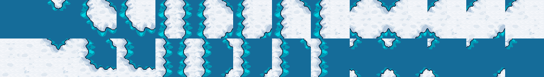

# Autotiler
Unpacks tilesets from a compressed one

Pure go. No external dependencies

Tileset-Generator unpacks tileset like this:


To tilesets like this:

16x1 Terrain 1 to 2:


16x1 Terrain 2 to 1:


14x2:




## How to use
* put simple tileset image (for example 2x3_packed.png) to source folder
* run
  ```go run . ./examples/2x3_packed.png output.local.png```
* grab complite tileset (for example output.local.png)
* enjoy

## Features and plans
- [x] Unpack from 6 tiles to 16 tiles
- [x] Unpack from 6 tiles to 28 tiles
- [ ] Unpack from 6 or 16 tiles to 47 tiles
- [ ] Unpack from 6 or 16 tiles to 256 tiles
- [ ] Export to Tiled
- [ ] Export to Godot

  [//]: # (- [x] Unpack from 6 or 28 tiles to 92 tiles)